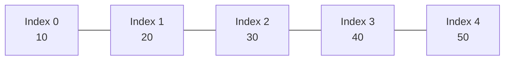
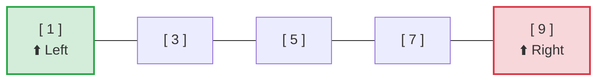
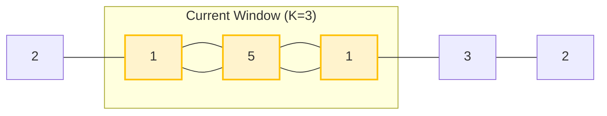
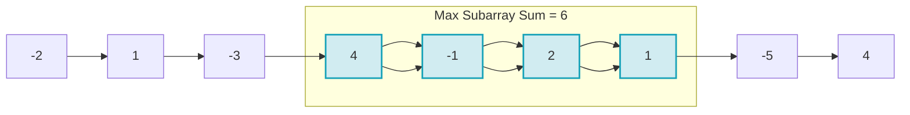
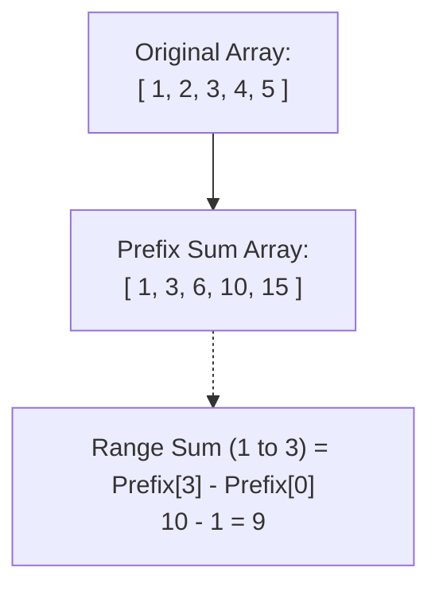
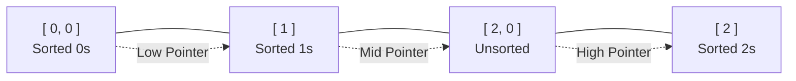

# 🔢 Array — Complete Learning Guide

## 📖 Table of Contents
1. [Array Basics](#1-array-basics)
2. [Two Pointer Technique](#2-two-pointer-technique)
3. [Sliding Window Pattern](#3-sliding-window-pattern)
4. [Kadane's Algorithm](#4-kadanes-algorithm)
5. [Prefix Sum Technique](#5-prefix-sum-technique)
6. [Dutch National Flag](#6-dutch-national-flag-algorithm)
7. [Matrix Problems](#7-matrix-problems)
8. [Solved Problems](#8-solved-problems)

---

## 1. Array Basics

### Array Kya Hai?
Array ek **fixed-size sequential collection** hai jisme same type ke elements store hote hain. Java mein arrays **0-indexed** hote hain (matlab pehla element index 0 pe hai).



```java
// Array declare karna aur initialize karna
int[] arr = new int[5];          // size 5 ka empty array (sab 0 honge)
int[] arr2 = {10, 20, 30, 40, 50}; // directly values de do
String[] names = {"Ram", "Shyam", "Mohan"}; // String array

// Array traverse karna
for (int i = 0; i < arr2.length; i++) {
    System.out.println(arr2[i]); // index se access karo
}

// Enhanced for loop (for-each)
for (int num : arr2) {
    System.out.println(num); // directly element milta hai
}
```

### Key Points Yaad Rakho:
- Array ka size **fixed** hota hai — create hone ke baad change nahi hota
- **Index 0 se start** hota hai, last index = length - 1
- `arr.length` se size milta hai (brackets nahi lagte, ye property hai)
- **ArrayIndexOutOfBoundsException** — galat index access karne pe milta hai

---

## 2. Two Pointer Technique

### Concept Kya Hai?
Do pointers (variables) use karo array mein — ek left se, ek right se. Dono milke problem solve karte hain. Ye technique **sorted arrays** pe bahut kaam aati hai.

### Kab Use Karna Hai?
- Pair find karna hai with given sum
- Array reverse karna hai
- Duplicates remove karne hain sorted array se
- Container with most water type problems



```java
// ✅ Problem: Two Sum (Sorted Array) — do numbers dhundho jinke sum = target
// Approach: Left pointer start se, Right pointer end se, sum compare karo
// Time: O(n), Space: O(1)

public static int[] twoSumSorted(int[] arr, int target) {
    int left = 0;                    // left pointer array ke start pe
    int right = arr.length - 1;      // right pointer array ke end pe
    
    while (left < right) {           // jab tak left < right hai
        int sum = arr[left] + arr[right]; // dono pointers ke elements ka sum
        
        if (sum == target) {         // sum mil gaya target ke barabar!
            return new int[]{left, right}; // indices return karo
        } else if (sum < target) {   // sum chhota hai → left badhao
            left++;                  // left pointer aage le jao (bada number chahiye)
        } else {                     // sum bada hai → right ghatao
            right--;                 // right pointer peeche le jao (chhota number chahiye)
        }
    }
    return new int[]{-1, -1};        // koi pair nahi mila
}

// Dry Run Example:
// arr = [1, 3, 5, 7, 9], target = 12
// left=0, right=4 → sum=1+9=10 < 12 → left++
// left=1, right=4 → sum=3+9=12 == 12 ✅ → return {1, 4}
```

```java
// ✅ Problem: Reverse Array in-place
// Approach: Left aur Right swap karte jao, dono beech mein aayenge
// Time: O(n), Space: O(1)

public static void reverseArray(int[] arr) {
    int left = 0;                    // start se shuru
    int right = arr.length - 1;      // end se shuru
    
    while (left < right) {           // jab tak dono mile nahi
        // swap karo — temporary variable use karke
        int temp = arr[left];        // left wala save karo
        arr[left] = arr[right];      // right wala left pe daal do
        arr[right] = temp;           // saved value right pe daal do
        
        left++;                      // left aage badhao
        right--;                     // right peeche le jao
    }
}
```

---

## 3. Sliding Window Pattern

### Concept Kya Hai?
Ek **window** (sub-array) ko array pe slide karte hain. Window ka size fixed ya variable ho sakta hai. Ye technique **subarray/substring** problems mein bahut useful hai.

### Kab Use Karna Hai?
- Maximum/Minimum sum subarray of size K
- Longest substring with K distinct characters
- Subarray with given sum



```java
// ✅ Problem: Maximum sum subarray of size K
// Approach: Fixed size window slide karo, har position pe sum track karo
// Time: O(n), Space: O(1)

public static int maxSumSubarray(int[] arr, int k) {
    int n = arr.length;
    
    // Pehle window ka sum nikalo (first K elements)
    int windowSum = 0;
    for (int i = 0; i < k; i++) {
        windowSum += arr[i];          // pehle K elements ka sum
    }
    
    int maxSum = windowSum;           // abhi tak ka maximum sum
    
    // Ab window slide karo — ek element add, ek remove
    for (int i = k; i < n; i++) {
        windowSum += arr[i];          // naya element add karo (window mein aaya)
        windowSum -= arr[i - k];      // purana element remove karo (window se gaya)
        maxSum = Math.max(maxSum, windowSum); // maximum update karo
    }
    
    return maxSum;
}

// Dry Run Example:
// arr = [2, 1, 5, 1, 3, 2], k = 3
// Initial window: [2,1,5] → sum = 8
// Slide: [1,5,1] → sum = 8-2+1 = 7
// Slide: [5,1,3] → sum = 7-1+3 = 9 ✅ max
// Slide: [1,3,2] → sum = 9-5+2 = 6
// Answer: 9
```

```java
// ✅ Problem: Longest Substring Without Repeating Characters
// Approach: Variable size sliding window + HashSet
// Time: O(n), Space: O(min(n, 26))

import java.util.HashSet;

public static int longestUniqueSubstring(String s) {
    HashSet<Character> set = new HashSet<>(); // window mein kaunse characters hain
    int left = 0;                             // window ka left boundary
    int maxLen = 0;                           // maximum length track karo
    
    for (int right = 0; right < s.length(); right++) { // right pointer badhate jao
        char c = s.charAt(right);             // current character
        
        // Agar character already window mein hai → left ko shrink karo
        while (set.contains(c)) {             // jab tak duplicate hai
            set.remove(s.charAt(left));       // left wala character hatao
            left++;                           // left pointer aage badhao
        }
        
        set.add(c);                           // current character add karo
        maxLen = Math.max(maxLen, right - left + 1); // window size update karo
    }
    
    return maxLen;
}
```

---

## 4. Kadane's Algorithm

### Concept Kya Hai?
**Maximum subarray sum** find karne ka sabse efficient algorithm. Idea simple hai — har position pe decide karo: "current element se naya subarray shuru karein ya purana continue karein?"



```java
// ✅ Problem: Maximum Subarray Sum (Kadane's Algorithm)
// Approach: Har element pe decide karo — extend ya restart
// Time: O(n), Space: O(1)

public static int maxSubarraySum(int[] arr) {
    int currentSum = arr[0];          // current subarray ka sum
    int maxSum = arr[0];              // overall maximum sum
    
    for (int i = 1; i < arr.length; i++) {
        // Decision: current element ko existing subarray mein jodo
        //           ya naya subarray shuru karo current element se
        currentSum = Math.max(arr[i], currentSum + arr[i]);
        
        // Overall maximum update karo
        maxSum = Math.max(maxSum, currentSum);
    }
    
    return maxSum;
}

// Dry Run Example:
// arr = [-2, 1, -3, 4, -1, 2, 1, -5, 4]
// i=0: currentSum=-2, maxSum=-2
// i=1: currentSum=max(1, -2+1)=1, maxSum=1
// i=2: currentSum=max(-3, 1-3)=-2, maxSum=1
// i=3: currentSum=max(4, -2+4)=4, maxSum=4
// i=4: currentSum=max(-1, 4-1)=3, maxSum=4
// i=5: currentSum=max(2, 3+2)=5, maxSum=5
// i=6: currentSum=max(1, 5+1)=6, maxSum=6 ✅
// i=7: currentSum=max(-5, 6-5)=1, maxSum=6
// i=8: currentSum=max(4, 1+4)=5, maxSum=6
// Answer: 6 (subarray [4, -1, 2, 1])
```

---

## 5. Prefix Sum Technique

### Concept Kya Hai?
Ek nayi array banao jisme har index pe **sum of all elements from 0 to that index** store ho. Isse kisi bhi range ka sum **O(1)** mein nikaal sakte ho.



```java
// ✅ Prefix Sum Array banana
// Time: O(n), Space: O(n)

public static int[] buildPrefixSum(int[] arr) {
    int n = arr.length;
    int[] prefix = new int[n];
    
    prefix[0] = arr[0];              // pehla element wahi rehta hai
    for (int i = 1; i < n; i++) {
        prefix[i] = prefix[i-1] + arr[i]; // previous sum + current element
    }
    
    return prefix;
}

// Range Sum query: arr[l] se arr[r] tak ka sum
// Formula: prefix[r] - prefix[l-1] (agar l > 0)
//          prefix[r] (agar l == 0)

public static int rangeSum(int[] prefix, int l, int r) {
    if (l == 0) return prefix[r];
    return prefix[r] - prefix[l - 1];
}

// Example:
// arr    = [1, 2, 3, 4, 5]
// prefix = [1, 3, 6, 10, 15]
// Sum(1,3) = prefix[3] - prefix[0] = 10 - 1 = 9 (2+3+4=9) ✅
```

```java
// ✅ Problem: Subarray Sum Equals K
// Approach: Prefix Sum + HashMap se count karo
// Time: O(n), Space: O(n)

import java.util.HashMap;

public static int subarraySumK(int[] arr, int k) {
    HashMap<Integer, Integer> prefixMap = new HashMap<>(); // prefix_sum → count
    prefixMap.put(0, 1);              // sum 0 ek baar already hai (empty subarray)
    
    int currentSum = 0;               // running prefix sum
    int count = 0;                    // kitne subarrays ka sum = k
    
    for (int num : arr) {
        currentSum += num;            // current prefix sum update karo
        
        // Agar (currentSum - k) pehle kahi exist karta hai,
        // toh wahan se yahan tak ka subarray sum = k hai!
        if (prefixMap.containsKey(currentSum - k)) {
            count += prefixMap.get(currentSum - k);
        }
        
        // Current prefix sum ko map mein daal do
        prefixMap.put(currentSum, prefixMap.getOrDefault(currentSum, 0) + 1);
    }
    
    return count;
}
```

---

## 6. Dutch National Flag Algorithm

### Concept Kya Hai?
**3 types ke elements** ko sort karna hai (jaise 0, 1, 2). Three pointers use karte hain — low, mid, high. Ye **single pass O(n)** mein kaam karta hai.



```java
// ✅ Problem: Sort Colors (0s, 1s, 2s sort karo)
// Approach: Dutch National Flag — 3 pointers
// Time: O(n), Space: O(1)

public static void sortColors(int[] arr) {
    int low = 0;                      // 0 yahan tak sorted hai
    int mid = 0;                      // current element check karo
    int high = arr.length - 1;        // 2 yahan se sorted hai
    
    while (mid <= high) {
        if (arr[mid] == 0) {
            // 0 mila → low ke saath swap karo, dono aage badhao
            swap(arr, low, mid);
            low++;
            mid++;
        } else if (arr[mid] == 1) {
            // 1 mila → sahi jagah hai, bas mid aage badhao
            mid++;
        } else {
            // 2 mila → high ke saath swap karo, sirf high peeche le jao
            swap(arr, mid, high);
            high--;
            // mid mat badhao! kyunki swapped element check karna hai
        }
    }
}

private static void swap(int[] arr, int i, int j) {
    int temp = arr[i];
    arr[i] = arr[j];
    arr[j] = temp;
}

// Dry Run:
// arr = [2, 0, 1, 2, 0, 1]
// low=0, mid=0, high=5: arr[mid]=2 → swap(0,5) → [1,0,1,2,0,2], high=4
// low=0, mid=0, high=4: arr[mid]=1 → mid++ → mid=1
// low=0, mid=1, high=4: arr[mid]=0 → swap(0,1) → [0,1,1,2,0,2], low=1, mid=2
// low=1, mid=2, high=4: arr[mid]=1 → mid++ → mid=3
// low=1, mid=3, high=4: arr[mid]=2 → swap(3,4) → [0,1,1,0,2,2], high=3
// low=1, mid=3, high=3: arr[mid]=0 → swap(1,3) → [0,0,1,1,2,2], low=2, mid=4
// mid > high → STOP ✅
// Result: [0, 0, 1, 1, 2, 2]
```

---

## 7. Matrix Problems

### 2D Array Basics

```java
// Matrix declare aur traverse karna
int[][] matrix = {
    {1, 2, 3},
    {4, 5, 6},
    {7, 8, 9}
};

int rows = matrix.length;          // rows ki count
int cols = matrix[0].length;       // columns ki count

// Row-wise traverse
for (int i = 0; i < rows; i++) {
    for (int j = 0; j < cols; j++) {
        System.out.print(matrix[i][j] + " ");
    }
    System.out.println();
}
```

```java
// ✅ Problem: Matrix ko 90° clockwise rotate karo
// Approach: Pehle transpose karo, phir har row reverse karo
// Time: O(n²), Space: O(1)

public static void rotateMatrix(int[][] matrix) {
    int n = matrix.length;
    
    // Step 1: Transpose — rows ko columns mein convert karo
    for (int i = 0; i < n; i++) {
        for (int j = i + 1; j < n; j++) { // j = i+1 se start (diagonal ke upar)
            int temp = matrix[i][j];
            matrix[i][j] = matrix[j][i];
            matrix[j][i] = temp;
        }
    }
    
    // Step 2: Har row ko reverse karo
    for (int i = 0; i < n; i++) {
        int left = 0, right = n - 1;
        while (left < right) {
            int temp = matrix[i][left];
            matrix[i][left] = matrix[i][right];
            matrix[i][right] = temp;
            left++;
            right--;
        }
    }
}

// Example:
// Original:    Transpose:    Reverse rows:
// 1 2 3        1 4 7         7 4 1
// 4 5 6   →    2 5 8    →    8 5 2
// 7 8 9        3 6 9         9 6 3
```

---

## 8. Solved Problems

### Problem 1: Trapping Rain Water 🔴 Hard
```java
// ✅ Problem: Given heights, calculate trapped rain water
// Approach: Two Pointer — left max aur right max track karo
// Time: O(n), Space: O(1)

public static int trapRainWater(int[] height) {
    int left = 0, right = height.length - 1; // two pointers
    int leftMax = 0, rightMax = 0;           // dono sides ka maximum
    int water = 0;                           // total trapped water
    
    while (left < right) {
        if (height[left] < height[right]) {
            // Left side chhoti hai → left se calculate karo
            if (height[left] >= leftMax) {
                leftMax = height[left];       // naya left max mila
            } else {
                water += leftMax - height[left]; // paani bhar sakta hai
            }
            left++;
        } else {
            // Right side chhoti hai → right se calculate karo
            if (height[right] >= rightMax) {
                rightMax = height[right];     // naya right max mila
            } else {
                water += rightMax - height[right]; // paani bhar sakta hai
            }
            right--;
        }
    }
    
    return water;
}

// Example: height = [0,1,0,2,1,0,1,3,2,1,2,1]
// Answer: 6 units of water trapped
```

### Problem 2: Best Time to Buy and Sell Stock 🟢 Easy
```java
// ✅ Problem: Stock prices diye hain, maximum profit find karo
// Approach: Minimum price track karo, har din profit calculate karo
// Time: O(n), Space: O(1)

public static int maxProfit(int[] prices) {
    int minPrice = Integer.MAX_VALUE;  // sabse kam price (buy karne ke liye)
    int maxProfit = 0;                 // maximum profit
    
    for (int price : prices) {
        if (price < minPrice) {
            minPrice = price;          // naya minimum mila → yahan buy karo
        } else {
            int profit = price - minPrice; // aaj sell karo toh kitna profit?
            maxProfit = Math.max(maxProfit, profit); // maximum profit update karo
        }
    }
    
    return maxProfit;
}

// Example: prices = [7, 1, 5, 3, 6, 4]
// Buy at 1, Sell at 6 → Profit = 5 ✅
```

### Problem 3: Merge Intervals 🟡 Medium
```java
// ✅ Problem: Overlapping intervals ko merge karo
// Approach: Sort by start, phir merge karte jao
// Time: O(n log n), Space: O(n)

import java.util.*;

public static int[][] mergeIntervals(int[][] intervals) {
    // Step 1: Start time ke basis pe sort karo
    Arrays.sort(intervals, (a, b) -> a[0] - b[0]);
    
    List<int[]> merged = new ArrayList<>();
    merged.add(intervals[0]);          // pehla interval daal do
    
    for (int i = 1; i < intervals.length; i++) {
        int[] last = merged.get(merged.size() - 1); // last merged interval
        int[] curr = intervals[i];                    // current interval
        
        if (curr[0] <= last[1]) {
            // Overlap hai! → end ko extend karo
            last[1] = Math.max(last[1], curr[1]);
        } else {
            // Overlap nahi hai → naya interval add karo
            merged.add(curr);
        }
    }
    
    return merged.toArray(new int[merged.size()][]);
}

// Example: [[1,3], [2,6], [8,10], [15,18]]
// [1,3] + [2,6] → overlap → [1,6]
// [1,6] + [8,10] → no overlap → add [8,10]
// [8,10] + [15,18] → no overlap → add [15,18]
// Result: [[1,6], [8,10], [15,18]]
```

### Problem 4: Product of Array Except Self 🟡 Medium
```java
// ✅ Problem: Har element ke liye baaki sab ka product (without division)
// Approach: Left product array + Right product array
// Time: O(n), Space: O(n)

public static int[] productExceptSelf(int[] nums) {
    int n = nums.length;
    int[] result = new int[n];
    
    // Step 1: Left products — har index pe uske left ke sab ka product
    result[0] = 1;                     // leftmost ka left product = 1
    for (int i = 1; i < n; i++) {
        result[i] = result[i-1] * nums[i-1]; // previous result × previous element
    }
    
    // Step 2: Right products multiply karo
    int rightProduct = 1;              // rightmost ka right product = 1
    for (int i = n - 1; i >= 0; i--) {
        result[i] *= rightProduct;     // left product × right product
        rightProduct *= nums[i];       // right product update karo
    }
    
    return result;
}

// Example: nums = [1, 2, 3, 4]
// Left products:  [1, 1, 2, 6]
// Right products: [24, 12, 4, 1]
// Result:         [24, 12, 8, 6] ✅
```

### Problem 5: Next Permutation 🟡 Medium
```java
// ✅ Problem: Array ka next lexicographic permutation find karo
// Approach: 3 steps — find dip, find swap, reverse suffix
// Time: O(n), Space: O(1)

public static void nextPermutation(int[] nums) {
    int n = nums.length;
    int i = n - 2;
    
    // Step 1: Right se left jao, pehla decreasing element dhundho
    while (i >= 0 && nums[i] >= nums[i + 1]) {
        i--;  // jab tak elements non-decreasing hain, peeche jao
    }
    
    if (i >= 0) {
        // Step 2: Right se left jao, nums[i] se just bada element dhundho
        int j = n - 1;
        while (nums[j] <= nums[i]) {
            j--;  // nums[i] se bada element dhundho
        }
        // Step 3: Swap karo
        swap(nums, i, j);
    }
    
    // Step 4: i+1 se end tak reverse karo
    reverse(nums, i + 1, n - 1);
}

private static void swap(int[] nums, int i, int j) {
    int temp = nums[i]; nums[i] = nums[j]; nums[j] = temp;
}

private static void reverse(int[] nums, int start, int end) {
    while (start < end) {
        swap(nums, start, end);
        start++; end--;
    }
}

// Example: [1, 2, 3] → [1, 3, 2]
// Example: [3, 2, 1] → [1, 2, 3] (last permutation → first)
```

---

## 🎯 Common Mistakes Avoid Karo

1. **Off-by-one error** — `i < arr.length` ya `i <= arr.length - 1` dhyan se likho
2. **Empty array check** — function ke start mein `if (arr == null || arr.length == 0)` check karo
3. **Integer overflow** — bade numbers ke liye `long` use karo
4. **In-place vs new array** — question dhyan se padho, kya modify karna allowed hai?
5. **Sorted vs unsorted** — approach change hota hai!

---

> **Next:** [PROBLEMS.md](PROBLEMS.md) mein practice problems karo! 💪
