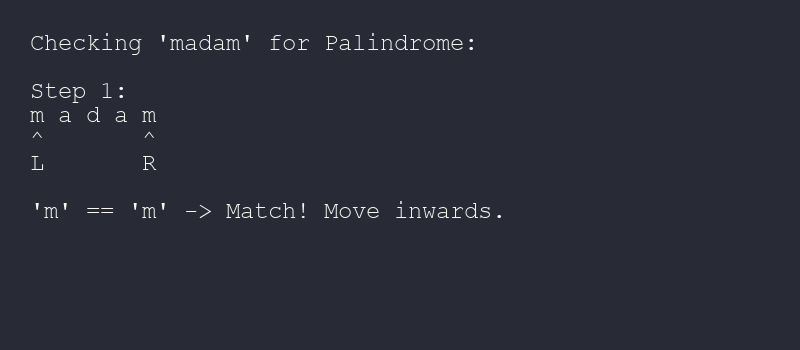
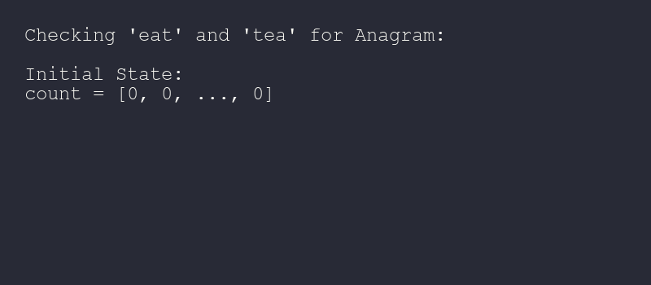
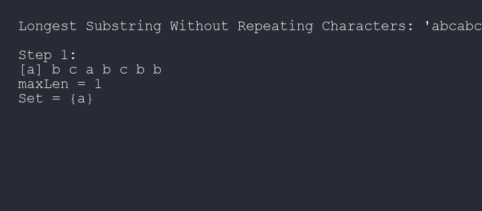

# 📝 String — Complete Learning Guide

## 📖 Table of Contents
1. [String Basics in Java](#1-string-basics-in-java)
2. [Palindrome Pattern](#2-palindrome-pattern)
3. [Anagram Pattern](#3-anagram-pattern)
4. [Sliding Window on Strings](#4-sliding-window-on-strings)
5. [Two Pointer on Strings](#5-two-pointer-on-strings)
6. [StringBuilder Usage](#6-stringbuilder-usage)
7. [Solved Problems](#7-solved-problems)

---

## 1. String Basics in Java

### String Immutability
Java mein String **immutable** hai — ek baar create hone ke baad modify nahi hota. Har modification se **nayi String** banti hai.

```java
// String basics
String s = "Hello";
s = s + " World";    // nayi String bani "Hello World", purani "Hello" garbage

// Important methods yaad rakho
String str = "Hello World";
str.length();             // 11 — length of string
str.charAt(0);            // 'H' — character at index
str.substring(0, 5);      // "Hello" — start (inclusive) to end (exclusive)
str.indexOf("World");     // 6 — pehli occurrence ka index
str.contains("llo");      // true — substring exists?
str.toLowerCase();        // "hello world"
str.toUpperCase();        // "HELLO WORLD"
str.trim();               // leading/trailing spaces hatao
str.equals("Hello World"); // true — content compare (== mat use karo!)
str.toCharArray();        // char array mein convert

// String to char array aur wapas
char[] chars = str.toCharArray();
String back = new String(chars);  // ya String.valueOf(chars)
```

### String vs StringBuilder vs StringBuffer
```java
// ❌ String concatenation loop mein — SLOW (O(n²))
String result = "";
for (int i = 0; i < n; i++) {
    result += "a";  // har baar nayi String banti hai — O(n) per operation
}

// ✅ StringBuilder use karo — FAST (O(n))
StringBuilder sb = new StringBuilder();
for (int i = 0; i < n; i++) {
    sb.append("a");  // same object modify hota hai — O(1) per operation
}
String result = sb.toString();

// StringBuilder important methods
sb.append("text");        // end mein add karo
sb.insert(0, "start");    // specific position pe insert
sb.delete(0, 3);          // range delete karo
sb.reverse();             // reverse karo
sb.charAt(0);             // character access
sb.length();              // length
sb.toString();            // String mein convert
```

---

## 2. Palindrome Pattern

### Palindrome Kya Hai?
Jo string ulta padho bhi same ho — jaise "madam", "racecar", "121".

<details>
<summary>🎥 <b>Visual Animation: Two Pointer Palindrome Check</b></summary>



```text
Checking "madam":

[Step 1]           [Step 2]           [Step 3]
m a d a m          m a d a m          m a d a m
↑       ↑            ↑   ↑              ↑
L       R            L   R             L,R
'm' == 'm'         'a' == 'a'         'd' == 'd'
Match! L++, R--    Match! L++, R--    L >= R, loop ends.

Result: It's a Palindrome! ✅
```
</details>

```java
// ✅ Problem: Check if String is Palindrome
// Approach: Two Pointer — dono sides se compare karo
// Time: O(n), Space: O(1)

public static boolean isPalindrome(String s) {
    int left = 0;                    // start se
    int right = s.length() - 1;      // end se
    
    while (left < right) {
        if (s.charAt(left) != s.charAt(right)) { // match nahi kiya
            return false;            // palindrome nahi hai
        }
        left++;                      // aage badhao
        right--;                     // peeche le jao
    }
    return true;                     // sab match hua — palindrome hai!
}
```

```java
// ✅ Problem: Valid Palindrome (ignore non-alphanumeric + case-insensitive)
// LeetCode 125
// Time: O(n), Space: O(1)

public static boolean isPalindromeValid(String s) {
    int left = 0, right = s.length() - 1;
    
    while (left < right) {
        // Left pointer: non-alphanumeric skip karo
        while (left < right && !Character.isLetterOrDigit(s.charAt(left))) {
            left++;
        }
        // Right pointer: non-alphanumeric skip karo
        while (left < right && !Character.isLetterOrDigit(s.charAt(right))) {
            right--;
        }
        // Case-insensitive compare
        if (Character.toLowerCase(s.charAt(left)) != Character.toLowerCase(s.charAt(right))) {
            return false;
        }
        left++;
        right--;
    }
    return true;
}

// Example: "A man, a plan, a canal: Panama" → true
```

```java
// ✅ Problem: Longest Palindromic Substring
// Approach: Expand Around Center — har character ko center maan ke expand karo
// Time: O(n²), Space: O(1)

public static String longestPalindrome(String s) {
    if (s.length() < 2) return s;
    
    int start = 0, maxLen = 0;       // result track karo
    
    for (int i = 0; i < s.length(); i++) {
        // Odd length palindrome: single character center
        int len1 = expandAroundCenter(s, i, i);
        // Even length palindrome: two character center
        int len2 = expandAroundCenter(s, i, i + 1);
        
        int len = Math.max(len1, len2); // dono mein se bada lo
        if (len > maxLen) {
            maxLen = len;
            start = i - (len - 1) / 2; // starting index calculate karo
        }
    }
    
    return s.substring(start, start + maxLen);
}

private static int expandAroundCenter(String s, int left, int right) {
    // Jab tak match ho raha hai, expand karo dono sides
    while (left >= 0 && right < s.length() && s.charAt(left) == s.charAt(right)) {
        left--;
        right++;
    }
    return right - left - 1; // palindrome ki length
}

// Example: "babad" → "bab" ya "aba" (dono valid)
```

---

## 3. Anagram Pattern

### Anagram Kya Hai?
Do strings jo **same characters** se bane hain sirf order alag hai — jaise "listen" aur "silent".

<details>
<summary>🎥 <b>Visual Animation: Frequency Array</b></summary>



```text
Checking "eat" and "tea":

1. Process 'e' in both:
   eat -> count['e']++  (count['e'] = 1)
   tea -> count['t']--  (count['t'] = -1)

2. Process 'a' in both:
   eat -> count['a']++  (count['a'] = 1)
   tea -> count['e']--  (count['e'] = 1 - 1 = 0)

3. Process 't' in both:
   eat -> count['t']++  (count['t'] = -1 + 1 = 0)
   tea -> count['a']--  (count['a'] = 1 - 1 = 0)

Final Array: All elements are 0.
Result: They are Anagrams! ✅
```
</details>

```java
// ✅ Problem: Check if two strings are anagrams
// Approach: Character frequency count compare karo
// Time: O(n), Space: O(1) — sirf 26 characters

public static boolean isAnagram(String s, String t) {
    if (s.length() != t.length()) return false; // length different → anagram nahi
    
    int[] count = new int[26];       // 26 lowercase letters ke liye
    
    for (int i = 0; i < s.length(); i++) {
        count[s.charAt(i) - 'a']++;  // s ke character ka count badhao
        count[t.charAt(i) - 'a']--;  // t ke character ka count ghatao
    }
    
    for (int c : count) {
        if (c != 0) return false;    // koi count 0 nahi → anagram nahi
    }
    return true;                     // sab 0 hain → anagram hai!
}
```

```java
// ✅ Problem: Group Anagrams
// Approach: Sorted string ko key banao, HashMap mein group karo
// Time: O(n * k log k), Space: O(n * k) — k = max string length

import java.util.*;

public static List<List<String>> groupAnagrams(String[] strs) {
    Map<String, List<String>> map = new HashMap<>();
    
    for (String s : strs) {
        char[] chars = s.toCharArray(); // string ko char array mein
        Arrays.sort(chars);             // sort karo — anagrams same ban jayenge
        String key = new String(chars); // sorted string = key
        
        // Key ke group mein add karo
        map.computeIfAbsent(key, k -> new ArrayList<>()).add(s);
    }
    
    return new ArrayList<>(map.values()); // saare groups return karo
}

// Example: ["eat","tea","tan","ate","nat","bat"]
// "aet" → [eat, tea, ate]
// "ant" → [tan, nat]
// "abt" → [bat]
```

---

## 4. Sliding Window on Strings

<details>
<summary>🎥 <b>Visual Animation: Sliding Window Concept</b></summary>



```text
Finding Longest Substring Without Repeating Characters in "abcabcbb"
[ ] = Current Window

Step 1: [a] b c a b c b b       -> maxLen = 1, set = {a}
Step 2: [a b] c a b c b b       -> maxLen = 2, set = {a,b}
Step 3: [a b c] a b c b b       -> maxLen = 3, set = {a,b,c}
Step 4: [a b c a] b c b b       -> Duplicate 'a'! Shrink left.
          [b c a] b c b b       -> maxLen = 3, set = {b,c,a}
Step 5:   [b c a b] c b b       -> Duplicate 'b'! Shrink left.
            [c a b] c b b       -> maxLen = 3, set = {c,a,b}
...
```
</details>

```java
// ✅ Problem: Longest Substring Without Repeating Characters
// Approach: Variable sliding window + HashSet
// Time: O(n), Space: O(min(n, 26))

public static int lengthOfLongestSubstring(String s) {
    Set<Character> set = new HashSet<>(); // window mein kaunse characters hain
    int left = 0, maxLen = 0;
    
    for (int right = 0; right < s.length(); right++) {
        char c = s.charAt(right);
        
        // Duplicate mila → left shrink karo jab tak duplicate nahi jata
        while (set.contains(c)) {
            set.remove(s.charAt(left));
            left++;
        }
        
        set.add(c);                      // current character add karo
        maxLen = Math.max(maxLen, right - left + 1); // max length update
    }
    
    return maxLen;
}

// Dry Run: "abcabcbb"
// right=0: set={a}, maxLen=1
// right=1: set={a,b}, maxLen=2
// right=2: set={a,b,c}, maxLen=3
// right=3: 'a' duplicate! shrink: remove 'a', left=1, set={b,c,a}, maxLen=3
// right=4: 'b' duplicate! shrink: remove 'b', left=2, set={c,a,b}, maxLen=3
// ... Answer: 3
```

```java
// ✅ Problem: Minimum Window Substring
// Approach: Sliding Window + frequency count
// Time: O(n), Space: O(1)

public static String minWindow(String s, String t) {
    if (s.length() < t.length()) return "";
    
    int[] need = new int[128];       // t ke characters ka count
    int[] have = new int[128];       // window mein characters ka count
    
    for (char c : t.toCharArray()) {
        need[c]++;                   // t mein kya chahiye
    }
    
    int required = 0;                // kitne unique chars match karne hain
    for (int n : need) if (n > 0) required++;
    
    int formed = 0;                  // kitne match ho chuke hain
    int left = 0;
    int minLen = Integer.MAX_VALUE;
    int minStart = 0;
    
    for (int right = 0; right < s.length(); right++) {
        char c = s.charAt(right);
        have[c]++;
        
        if (need[c] > 0 && have[c] == need[c]) {
            formed++;                // ek aur character fully match ho gaya
        }
        
        // Sab match ho gaye → shrink karo minimum window ke liye
        while (formed == required) {
            if (right - left + 1 < minLen) {
                minLen = right - left + 1;
                minStart = left;
            }
            
            char leftChar = s.charAt(left);
            have[leftChar]--;
            if (need[leftChar] > 0 && have[leftChar] < need[leftChar]) {
                formed--;
            }
            left++;
        }
    }
    
    return minLen == Integer.MAX_VALUE ? "" : s.substring(minStart, minStart + minLen);
}
```

---

## 5. Two Pointer on Strings

```java
// ✅ Problem: Reverse Words in a String
// Approach: Split, reverse, join
// Time: O(n), Space: O(n)

public static String reverseWords(String s) {
    String[] words = s.trim().split("\\s+"); // spaces se split karo
    StringBuilder sb = new StringBuilder();
    
    for (int i = words.length - 1; i >= 0; i--) { // ulta loop
        sb.append(words[i]);
        if (i > 0) sb.append(" ");   // words ke beech space
    }
    
    return sb.toString();
}

// Example: "  the sky  is blue  " → "blue is sky the"
```

```java
// ✅ Problem: String Compression
// Approach: Two pointers — count consecutive characters
// Time: O(n), Space: O(1)

public static int compress(char[] chars) {
    int write = 0;                   // kahan likhna hai
    int read = 0;                    // kahan se padh rahe hain
    
    while (read < chars.length) {
        char current = chars[read];
        int count = 0;
        
        // Same characters count karo
        while (read < chars.length && chars[read] == current) {
            read++;
            count++;
        }
        
        chars[write++] = current;    // character likho
        if (count > 1) {             // count > 1 hai toh count bhi likho
            for (char c : String.valueOf(count).toCharArray()) {
                chars[write++] = c;
            }
        }
    }
    
    return write;                    // new length
}

// Example: ['a','a','b','b','c','c','c'] → ['a','2','b','2','c','3'] → return 6
```

---

## 6. StringBuilder Usage

### Kab String, Kab StringBuilder?
```java
// ❌ BAD: Loop mein String concatenation
String result = "";
for (int i = 0; i < 10000; i++) {
    result += i;  // har baar nayi String — O(n²) total!
}

// ✅ GOOD: StringBuilder use karo
StringBuilder sb = new StringBuilder();
for (int i = 0; i < 10000; i++) {
    sb.append(i);  // same object modify — O(n) total
}
String result = sb.toString();
```

---

## 7. Solved Problems

### Problem: String to Integer (atoi) 🟡 Medium
```java
// ✅ Problem: String ko integer mein convert karo (edge cases handle karo)
// Time: O(n), Space: O(1)

public static int myAtoi(String s) {
    int i = 0, n = s.length();
    
    // Step 1: Leading spaces skip karo
    while (i < n && s.charAt(i) == ' ') i++;
    if (i == n) return 0;
    
    // Step 2: Sign check karo
    int sign = 1;
    if (s.charAt(i) == '-') { sign = -1; i++; }
    else if (s.charAt(i) == '+') { i++; }
    
    // Step 3: Digits process karo
    int result = 0;
    while (i < n && Character.isDigit(s.charAt(i))) {
        int digit = s.charAt(i) - '0';
        
        // Overflow check
        if (result > (Integer.MAX_VALUE - digit) / 10) {
            return sign == 1 ? Integer.MAX_VALUE : Integer.MIN_VALUE;
        }
        
        result = result * 10 + digit;
        i++;
    }
    
    return result * sign;
}
```

### Problem: Longest Common Prefix 🟢 Easy
```java
// ✅ Problem: String array mein longest common prefix find karo
// Time: O(n * m), Space: O(1) — n = strings, m = shortest string

public static String longestCommonPrefix(String[] strs) {
    if (strs == null || strs.length == 0) return "";
    
    String prefix = strs[0];         // pehli string ko prefix maano
    
    for (int i = 1; i < strs.length; i++) {
        // Jab tak current string prefix se start nahi hoti
        while (strs[i].indexOf(prefix) != 0) {
            prefix = prefix.substring(0, prefix.length() - 1); // ek character hatao
            if (prefix.isEmpty()) return ""; // koi common prefix nahi
        }
    }
    
    return prefix;
}

// Example: ["flower", "flow", "flight"] → "fl"
```

---

## 🎯 Common Mistakes

1. **String comparison**: `==` mat use karo, `.equals()` use karo
2. **StringBuilder bhool jaana**: Loop mein String + karna slow hai
3. **Index out of bounds**: `charAt()` se pehle length check karo
4. **Immutability**: String methods nayi string return karte hain, original change nahi hota
5. **Character operations**: `'a' - 'a' = 0`, `'z' - 'a' = 25` — ye formula yaad rakho

---

> **Next:** [PROBLEMS.md](PROBLEMS.md) mein practice problems karo! 💪
