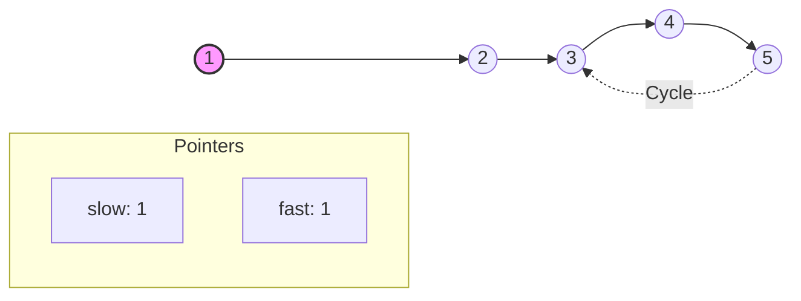
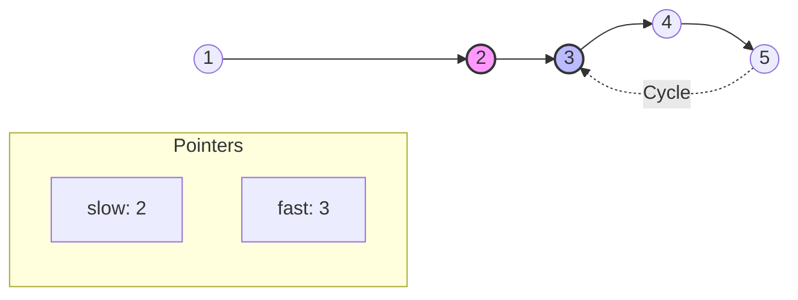
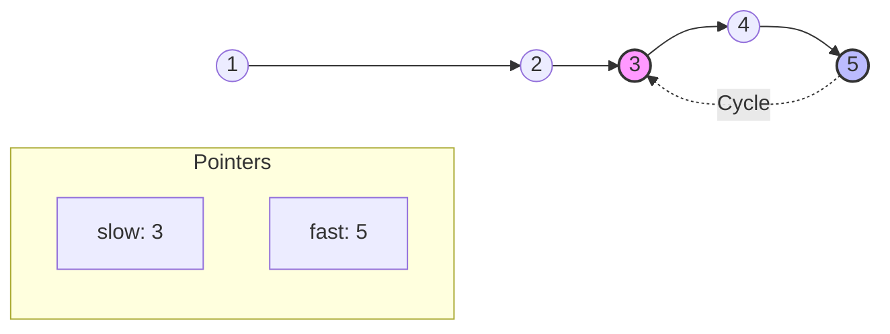
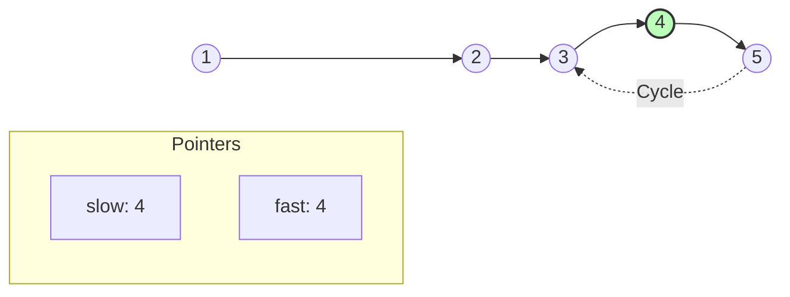
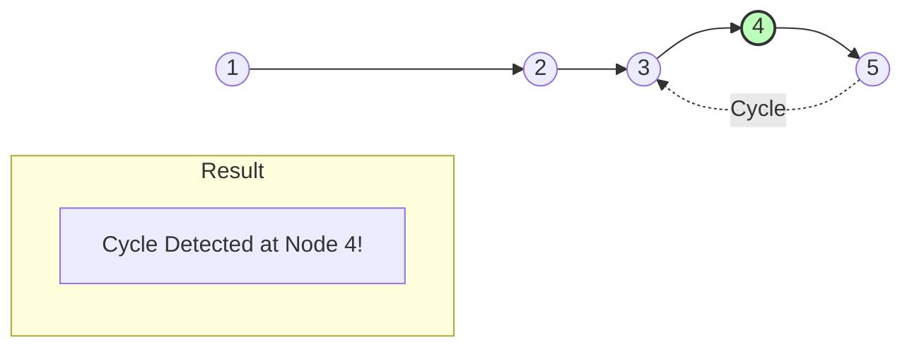

# Detect Cycle (Floyd's Algorithm) - Step-by-Step Visualization

This carousel explains how **Floyd's Cycle Detection** algorithm works. If there is a cycle, the `fast` pointer (moving 2 steps) will eventually catch up and meet the `slow` pointer (moving 1 step) inside the cycle.

````carousel
## Initial State
- `slow = head (1)`
- `fast = head (1)`

*(Note: Node 5 points back to Node 3, creating a cycle)*


<!-- slide -->
## Step 1
- `slow` moves 1 step to **2**
- `fast` moves 2 steps to **3**


<!-- slide -->
## Step 2
- `slow` moves 1 step to **3**
- `fast` moves 2 steps (`4` -> `5`) to **5**


<!-- slide -->
## Step 3
- `slow` moves 1 step to **4**
- `fast` moves 2 steps (`5` -> `3` -> `4`) to **4**


<!-- slide -->
## Final State
`slow == fast` (Both are now at Node **4**). 
Since they met, a cycle is successfully detected! We return `true`.


````
