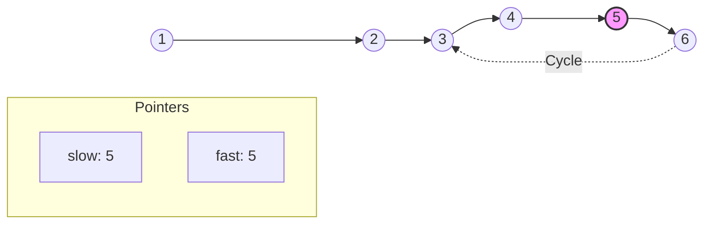
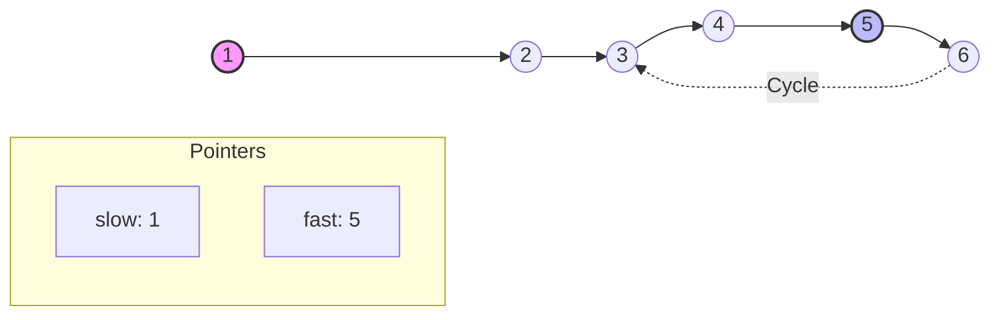
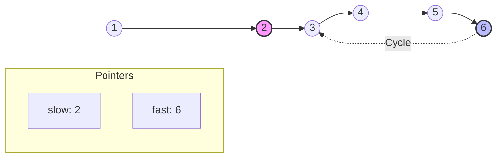
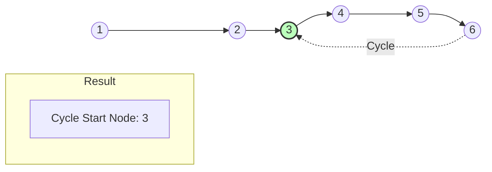

# Find Cycle Start Node - Step-by-Step Visualization

After detecting a cycle with Fast/Slow pointers, how do we find exactly **where** the cycle starts? This visualization explains the second phase of Floyd's Algorithm.

````carousel
## Step 1: Detect Cycle Meeting Point
First, we use Fast-Slow pointers to detect a cycle.
`fast` (2 steps) and `slow` (1 step) meet at Node `5` inside the cycle.


<!-- slide -->
## Step 2: Reset one pointer to Head
We move `slow` back to the `head` (Node 1), while `fast` stays exactly at the meeting point (Node 5).


<!-- slide -->
## Step 3: Move both 1 step at a time
Both pointers now move **1 step at a time** (no more fast pointer).
- `slow` moves to 2
- `fast` moves to 6


<!-- slide -->
## Step 4: Both meet at Cycle Start!
- `slow` moves to 3
- `fast` moves from 6 to 3 (following the cycle)

They meet at Node **3**, which is the exact start of the cycle! We return this node.


````
