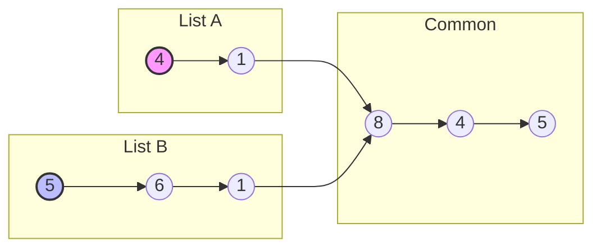
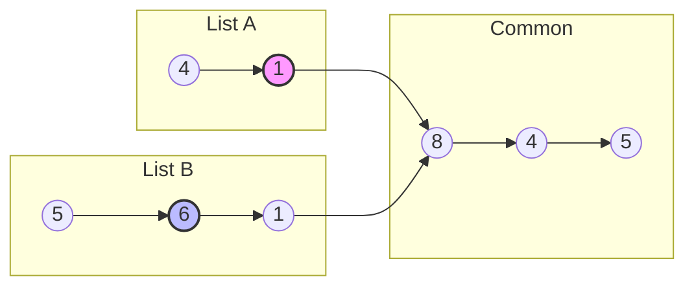
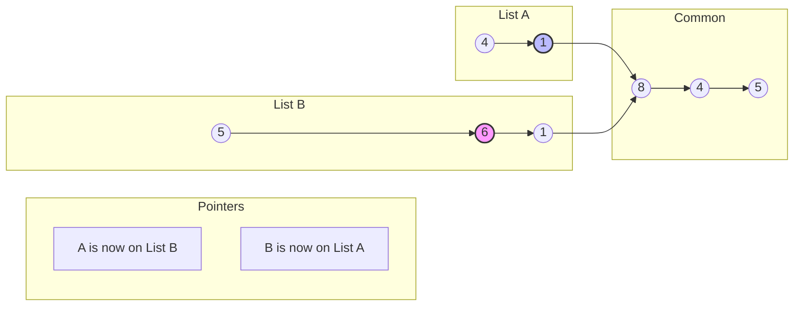
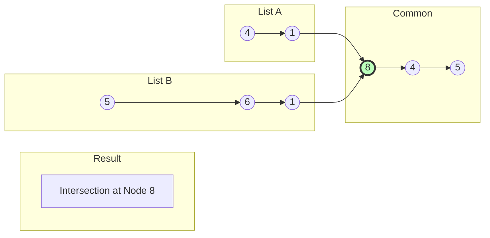

# Intersection of Two Linked Lists - Step-by-Step Visualization

This carousel explains the two-pointer approach to finding the intersection node of two lists with different lengths.

````carousel
## Initial State
Two lists intersect at Node `8`. Pointer `A` starts at Head A, `B` starts at Head B.


<!-- slide -->
## Moving Forward
Both move 1 step at a time. List B is longer, so pointer `A` will reach the end (`null`) first.


<!-- slide -->
## Swap Tracks
When a pointer reaches `null`, it jumps to the head of the **OTHER** list.
- `A` reached null, so it jumps to `Head B`.
- `B` reached null shortly after, jumping to `Head A`.

By swapping tracks, both pointers will traverse the exact same total distance!


<!-- slide -->
## Intersection Found
Because they swapped tracks, they are now perfectly synced. They will meet exactly at the intersection node (`8`) at the same time.


````
