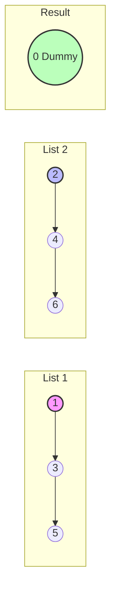
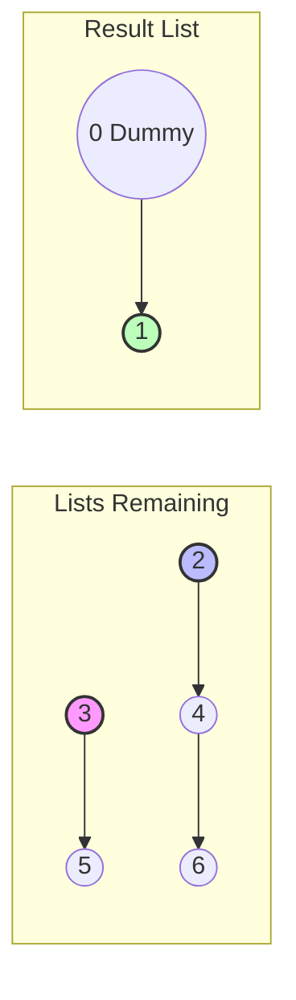
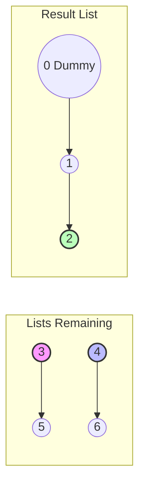
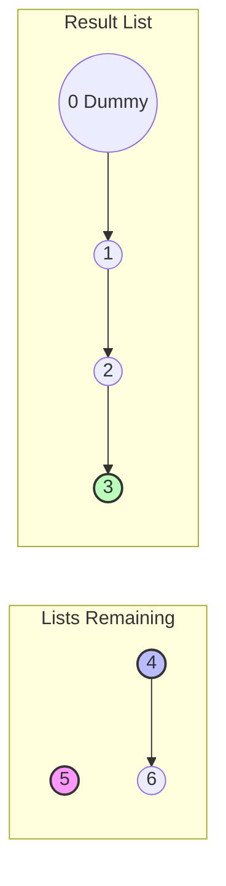
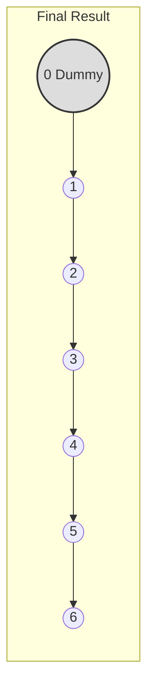

# Merge Two Sorted Lists - Step-by-Step Visualization

This interactive carousel explains how to merge two sorted linked lists using a **dummy** node and a `current` pointer.

````carousel
## Initial State
- Create a `dummy` node to hold the result.
- `current = dummy`
- `l1` points to the head of List 1 (`1`)
- `l2` points to the head of List 2 (`2`)


<!-- slide -->
## Step 1
- Compare: `l1.val (1) < l2.val (2)`
- Link: `current.next = l1`
- Move `l1` to `3`
- Move `current` to `1`


<!-- slide -->
## Step 2
- Compare: `l2.val (2) < l1.val (3)`
- Link: `current.next = l2`
- Move `l2` to `4`
- Move `current` to `2`


<!-- slide -->
## Step 3
- Compare: `l1.val (3) < l2.val (4)`
- Link: `current.next = l1`
- Move `l1` to `5`
- Move `current` to `3`


<!-- slide -->
## Final Steps
The process continues appending the smaller node (`4`, then `5`, then `6`).
Once one list is empty, we simply append the remaining nodes of the other list directly to `current.next`.
The final merged sorted list starts at `dummy.next`!


````
