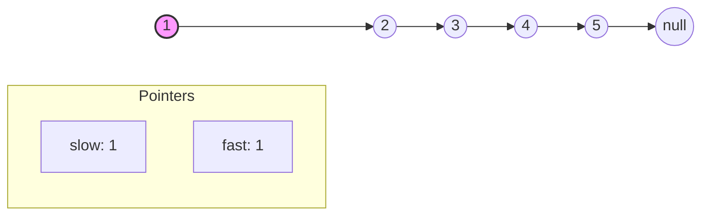
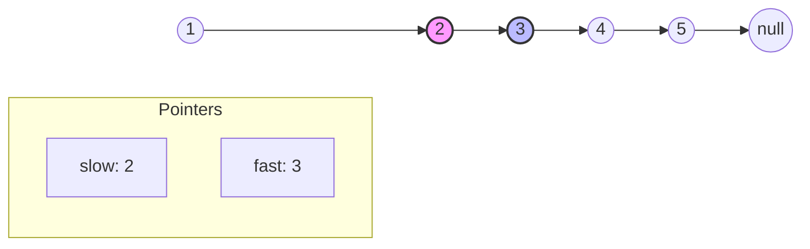
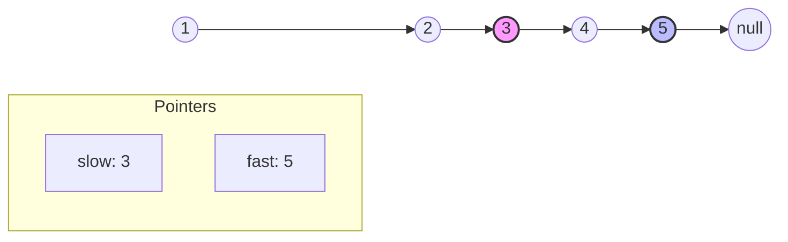
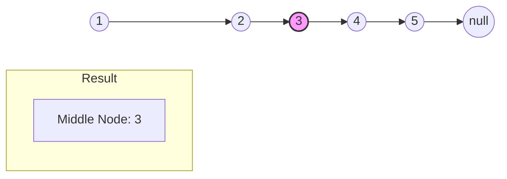

# Middle of Linked List - Step-by-Step Visualization

This interactive carousel explains the **Fast-Slow Pointer** technique to find the middle node of a linked list. `slow` moves 1 step at a time, while `fast` moves 2 steps.

````carousel
## Initial State
- `slow = head (1)`
- `fast = head (1)`


<!-- slide -->
## Step 1
- `slow` moves 1 step to **2**
- `fast` moves 2 steps to **3**


<!-- slide -->
## Step 2
- `slow` moves 1 step to **3**
- `fast` moves 2 steps to **5**


<!-- slide -->
## Final State
`fast.next` is null, so the loop terminates.
`slow` is currently at node **3**, which is exactly the middle of the linked list!


````
