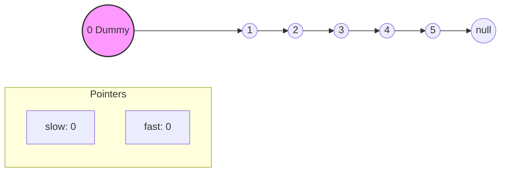
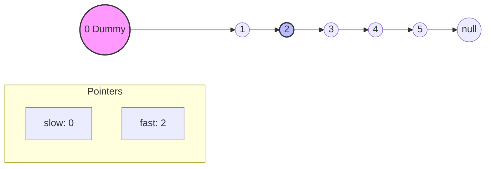
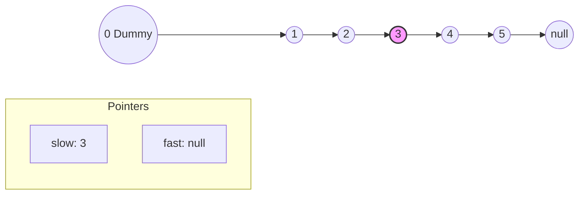
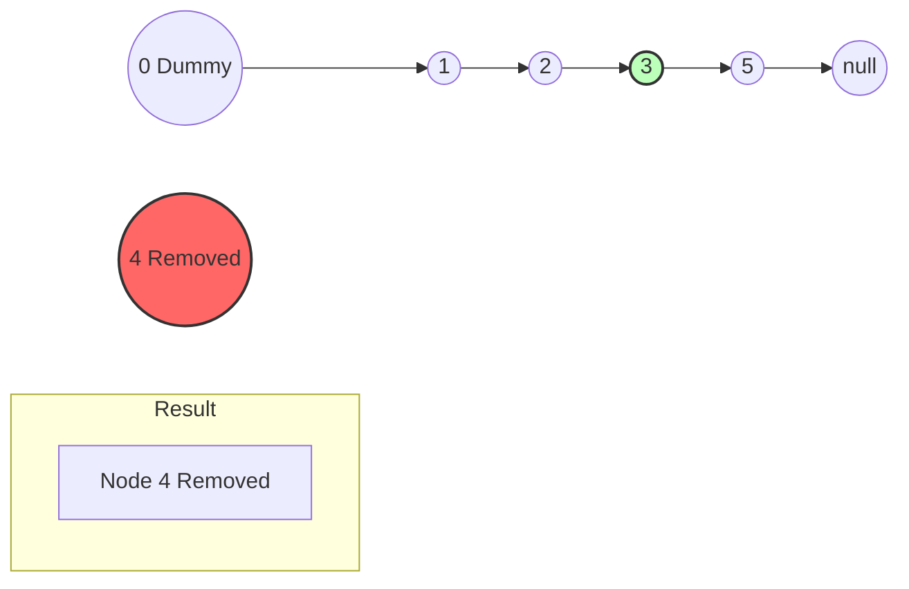

# Remove Nth Node From End - Step-by-Step Visualization

This carousel visualizes how to remove the Nth node from the end in a single pass using Fast-Slow pointers.

````carousel
## Initial State
Target: Remove **2nd** node from the end (Node 4).
We use a `dummy` node (0) to handle edge cases (like removing the head).
`fast` and `slow` both start at `dummy`.


<!-- slide -->
## Step 1: Move fast N+1 steps ahead
N=2. We move `fast` 2+1 = **3** steps ahead (to Node 2).
This creates a gap of exactly N nodes between `slow` and `fast`.


<!-- slide -->
## Step 2: Move both until fast is null
We move both pointers 1 step at a time simultaneously.
When `fast` reaches `null`, `slow` will be exactly on the node **right before** the target node!


<!-- slide -->
## Step 3: Remove the Target Node
`slow` is at Node 3. We remove Node 4 by skipping it:
`slow.next = slow.next.next` (3 points directly to 5).
Node 4 is removed!


````
