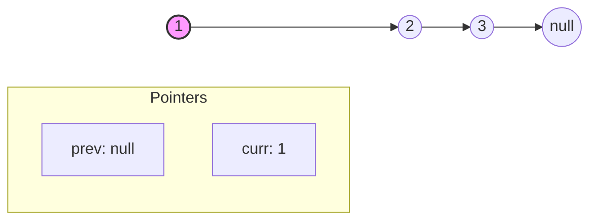
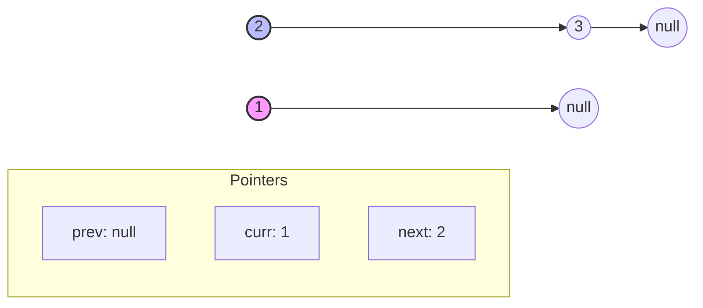
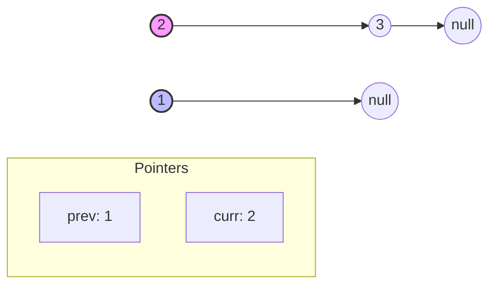
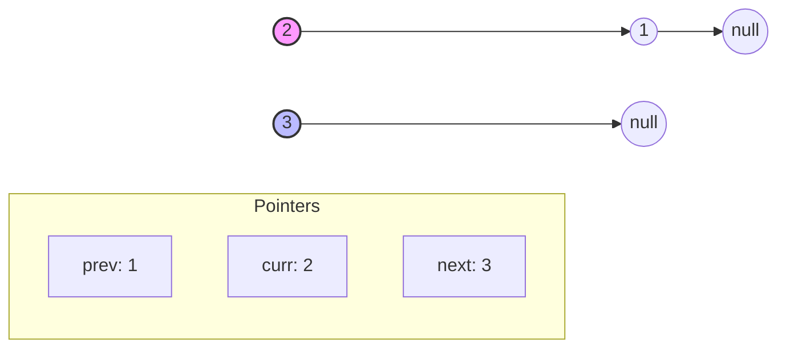
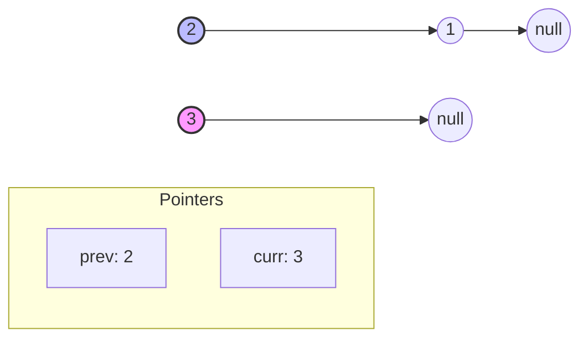
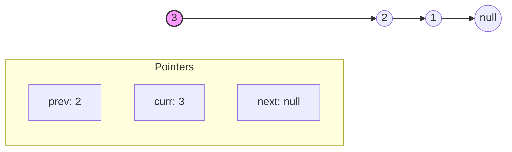
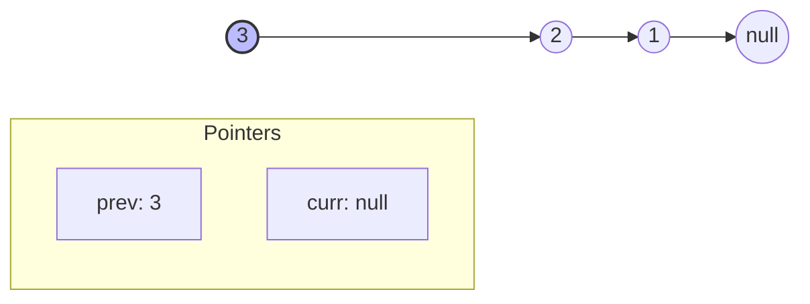
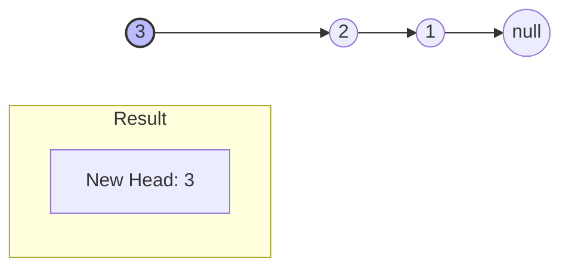

# Reverse Linked List - Step-by-Step Visualization

Here is a step-by-step visual explanation of the Iterative Reverse Linked List algorithm. You can navigate through the carousel to see how the pointers (`prev`, `curr`, `next`) change at each step.

````carousel
## Initial State
Before the loop starts, we initialize our pointers:
- `prev = null`
- `curr = head (1)`


<!-- slide -->
## Step 1: Save next and reverse pointer
- `next = curr.next (2)` (Save the next node so we don't lose it)
- `curr.next = prev` (Point 1's next to null)


<!-- slide -->
## Step 1: Move pointers forward
- `prev = curr (1)` (Move prev to current)
- `curr = next (2)` (Move current to next)


<!-- slide -->
## Step 2: Save next and reverse pointer
- `next = curr.next (3)`
- `curr.next = prev (1)` (Point 2's next to 1)


<!-- slide -->
## Step 2: Move pointers forward
- `prev = curr (2)`
- `curr = next (3)`


<!-- slide -->
## Step 3: Save next and reverse pointer
- `next = curr.next (null)`
- `curr.next = prev (2)` (Point 3's next to 2)


<!-- slide -->
## Step 3: Move pointers forward
- `prev = curr (3)`
- `curr = next (null)`


<!-- slide -->
## Final State
The loop ends because `curr == null`. We return `prev` which is the new head of the reversed linked list!


````
