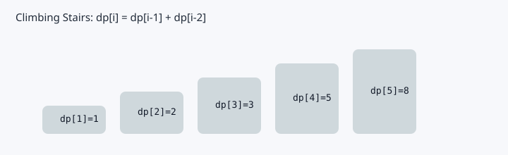
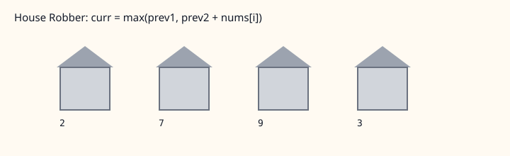
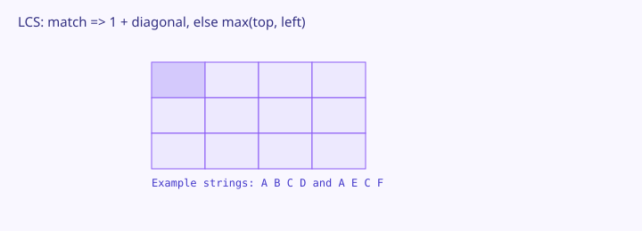
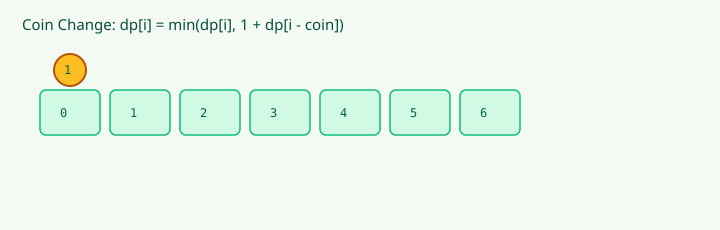
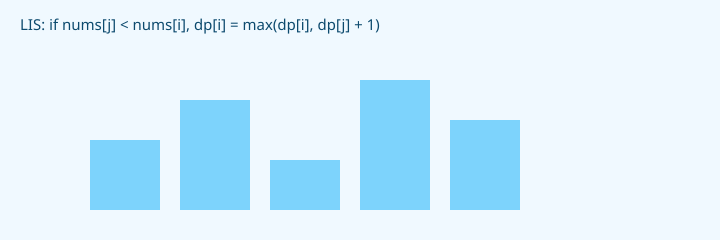

# 🧩 Dynamic Programming — Complete Learning Guide

## 1. DP Kya Hai? (Memoization vs Tabulation)

### Concept
DP = Recursion + Store results (taaki dobara compute na karo)

```java
// ❌ Plain Recursion — O(2^n) — SLOW!
public static int fib(int n) {
    if (n <= 1) return n;
    return fib(n - 1) + fib(n - 2);  // bahut baar same value calculate hoti hai
}

// ✅ Memoization (Top-Down) — O(n) — recursion + cache
public static int fibMemo(int n, int[] memo) {
    if (n <= 1) return n;
    if (memo[n] != 0) return memo[n]; // already calculated hai
    memo[n] = fibMemo(n - 1, memo) + fibMemo(n - 2, memo);
    return memo[n];
}

// ✅ Tabulation (Bottom-Up) — O(n) — loop + array
public static int fibTab(int n) {
    if (n <= 1) return n;
    int[] dp = new int[n + 1];
    dp[0] = 0; dp[1] = 1;
    for (int i = 2; i <= n; i++) {
        dp[i] = dp[i - 1] + dp[i - 2];
    }
    return dp[n];
}

// ✅ Space Optimized — O(1) space
public static int fibOptimal(int n) {
    if (n <= 1) return n;
    int prev2 = 0, prev1 = 1;
    for (int i = 2; i <= n; i++) {
        int curr = prev1 + prev2;
        prev2 = prev1;
        prev1 = curr;
    }
    return prev1;
}
```

## 2. 1D DP Problems

### Climbing Stairs


```java
// ✅ n stairs, 1 ya 2 step at a time — kitne ways?
// Same as Fibonacci!
public static int climbStairs(int n) {
    if (n <= 2) return n;
    int prev2 = 1, prev1 = 2;
    for (int i = 3; i <= n; i++) {
        int curr = prev1 + prev2;
        prev2 = prev1; prev1 = curr;
    }
    return prev1;
}
```

### House Robber


```java
// ✅ Adjacent houses rob nahi kar sakte, maximum money?
// dp[i] = max(rob this + dp[i-2], skip this + dp[i-1])
// Time: O(n), Space: O(1)

public static int rob(int[] nums) {
    int prev2 = 0, prev1 = 0;
    for (int num : nums) {
        int curr = Math.max(prev1, prev2 + num); // skip ya rob
        prev2 = prev1;
        prev1 = curr;
    }
    return prev1;
}
```

## 3. 2D DP Problems

### Longest Common Subsequence (LCS)


```java
// ✅ Do strings ka longest common subsequence
// Time: O(m * n), Space: O(m * n)

public static int longestCommonSubsequence(String text1, String text2) {
    int m = text1.length(), n = text2.length();
    int[][] dp = new int[m + 1][n + 1]; // dp[i][j] = LCS of first i and first j chars
    
    for (int i = 1; i <= m; i++) {
        for (int j = 1; j <= n; j++) {
            if (text1.charAt(i - 1) == text2.charAt(j - 1)) {
                dp[i][j] = 1 + dp[i - 1][j - 1]; // match! include karo
            } else {
                dp[i][j] = Math.max(dp[i - 1][j], dp[i][j - 1]); // skip one
            }
        }
    }
    
    return dp[m][n];
}
```

### Edit Distance


```java
// ✅ Minimum operations (insert/delete/replace) to convert word1 to word2
// Time: O(m * n)

public static int minDistance(String word1, String word2) {
    int m = word1.length(), n = word2.length();
    int[][] dp = new int[m + 1][n + 1];
    
    for (int i = 0; i <= m; i++) dp[i][0] = i; // delete all
    for (int j = 0; j <= n; j++) dp[0][j] = j; // insert all
    
    for (int i = 1; i <= m; i++) {
        for (int j = 1; j <= n; j++) {
            if (word1.charAt(i - 1) == word2.charAt(j - 1)) {
                dp[i][j] = dp[i - 1][j - 1];  // same hai, kuch mat karo
            } else {
                dp[i][j] = 1 + Math.min(dp[i - 1][j - 1], // replace
                               Math.min(dp[i - 1][j],      // delete
                                       dp[i][j - 1]));     // insert
            }
        }
    }
    
    return dp[m][n];
}
```

## 4. Knapsack Pattern

### 0/1 Knapsack
```java
// ✅ Weight limit W, items with weight[] and value[], maximize value
// Time: O(n * W)

public static int knapsack(int W, int[] weight, int[] value, int n) {
    int[][] dp = new int[n + 1][W + 1];
    
    for (int i = 1; i <= n; i++) {
        for (int w = 1; w <= W; w++) {
            if (weight[i - 1] <= w) {
                dp[i][w] = Math.max(
                    dp[i - 1][w],                            // skip item
                    value[i - 1] + dp[i - 1][w - weight[i - 1]] // take item
                );
            } else {
                dp[i][w] = dp[i - 1][w];                    // can't take
            }
        }
    }
    
    return dp[n][W];
}
```

### Coin Change


```java
// ✅ Minimum coins for amount (unlimited supply)
// Time: O(amount * coins)

public static int coinChange(int[] coins, int amount) {
    int[] dp = new int[amount + 1];
    Arrays.fill(dp, amount + 1);     // impossible value
    dp[0] = 0;                       // 0 amount ke liye 0 coins
    
    for (int i = 1; i <= amount; i++) {
        for (int coin : coins) {
            if (coin <= i) {
                dp[i] = Math.min(dp[i], 1 + dp[i - coin]); // ek coin use karo
            }
        }
    }
    
    return dp[amount] > amount ? -1 : dp[amount];
}
```

## 5. Longest Increasing Subsequence (LIS)



```java
// ✅ LIS — O(n²) approach
public static int lengthOfLIS(int[] nums) {
    int n = nums.length;
    int[] dp = new int[n];
    Arrays.fill(dp, 1);             // har element khud mein LIS = 1
    int maxLen = 1;
    
    for (int i = 1; i < n; i++) {
        for (int j = 0; j < i; j++) {
            if (nums[j] < nums[i]) {
                dp[i] = Math.max(dp[i], dp[j] + 1);
            }
        }
        maxLen = Math.max(maxLen, dp[i]);
    }
    
    return maxLen;
}
```

## 🎯 DP Problem Identification
| Keyword | DP Type |
|---------|---------|
| "count ways" | Fibonacci-like, Climbing stairs |
| "min/max cost" | Knapsack, Coin change |
| "longest subsequence" | LCS, LIS |
| "can reach / possible?" | Boolean DP |
| "string matching" | 2D DP (LCS, Edit Distance) |
| "partition equal subset" | 0/1 Knapsack variant |

---

> **Next:** [PROBLEMS.md](PROBLEMS.md) 💪
