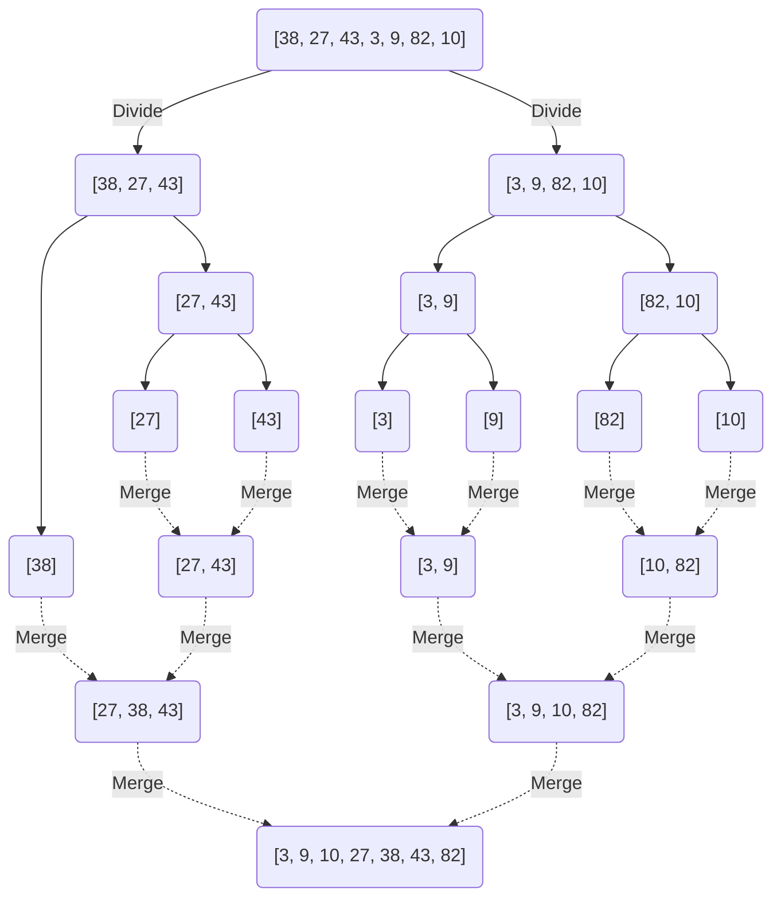
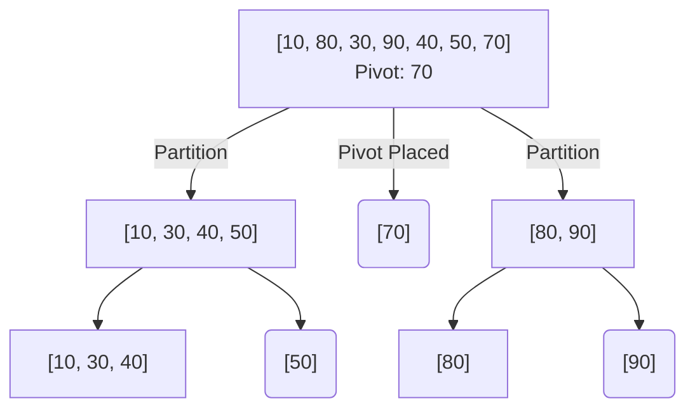
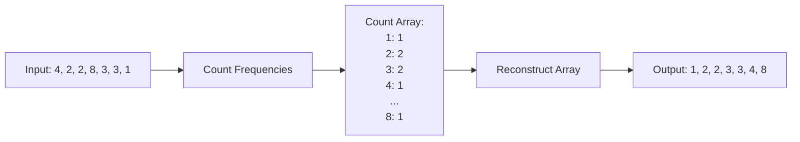

# 📊 Sorting — Complete Learning Guide

## 1. Bubble Sort
```mermaid
flowchart TD
    Start([Start]) --> InitI[i = 0]
    InitI --> CondI{i < n-1?}
    CondI -- Yes --> SetSwap[swapped = false]
    SetSwap --> InitJ[j = 0]
    InitJ --> CondJ{j < n - 1 - i?}
    CondJ -- Yes --> Compare{arr[j] > arr[j+1]?}
    Compare -- Yes --> Swap[Swap elements]
    Swap --> SetSwapTrue[swapped = true]
    SetSwapTrue --> IncJ[j++]
    Compare -- No --> IncJ
    IncJ --> CondJ
    CondJ -- No --> CheckSwap{swapped?}
    CheckSwap -- Yes --> IncI[i++]
    CheckSwap -- No --> End([Sorted / End])
    IncI --> CondI
    CondI -- No --> End
```
```java
// Sabse simple — adjacent elements swap karo agar wrong order mein hain
// Time: O(n²), Space: O(1), Stable: Yes

public static void bubbleSort(int[] arr) {
    int n = arr.length;
    for (int i = 0; i < n - 1; i++) {         // n-1 passes
        boolean swapped = false;
        for (int j = 0; j < n - 1 - i; j++) { // har pass mein last element fix
            if (arr[j] > arr[j + 1]) {
                int temp = arr[j]; arr[j] = arr[j + 1]; arr[j + 1] = temp;
                swapped = true;
            }
        }
        if (!swapped) break;                   // already sorted
    }
}
```

## 2. Selection Sort
```mermaid
flowchart TD
    Start([Start]) --> InitI[i = 0]
    InitI --> CondI{i < n-1?}
    CondI -- Yes --> MinIdx[minIdx = i]
    MinIdx --> InitJ[j = i + 1]
    InitJ --> CondJ{j < n?}
    CondJ -- Yes --> Compare{arr[j] < arr[minIdx]?}
    Compare -- Yes --> UpdateMin[minIdx = j]
    Compare -- No --> IncJ[j++]
    UpdateMin --> IncJ
    IncJ --> CondJ
    CondJ -- No --> Swap[Swap arr[i] and arr[minIdx]]
    Swap --> IncI[i++]
    IncI --> CondI
    CondI -- No --> End([Sorted / End])
```
```java
// Minimum dhundho, front mein daalo
// Time: O(n²), Space: O(1), Stable: No

public static void selectionSort(int[] arr) {
    int n = arr.length;
    for (int i = 0; i < n - 1; i++) {
        int minIdx = i;
        for (int j = i + 1; j < n; j++) {
            if (arr[j] < arr[minIdx]) minIdx = j; // minimum dhundho
        }
        int temp = arr[i]; arr[i] = arr[minIdx]; arr[minIdx] = temp; // swap
    }
}
```

## 3. Insertion Sort
```mermaid
flowchart TD
    Start([Start]) --> InitI[i = 1]
    InitI --> CondI{i < n?}
    CondI -- Yes --> Key[key = arr[i]]
    Key --> InitJ[j = i - 1]
    InitJ --> CondJ{"j >= 0 && arr[j] > key?"}
    CondJ -- Yes --> Shift[arr[j+1] = arr[j]]
    Shift --> DecJ[j--]
    DecJ --> CondJ
    CondJ -- No --> Insert[arr[j+1] = key]
    Insert --> IncI[i++]
    IncI --> CondI
    CondI -- No --> End([Sorted / End])
```
```java
// Card sorting jaisa — sahi jagah insert karo
// Time: O(n²), Space: O(1), Stable: Yes, Best for small/nearly sorted

public static void insertionSort(int[] arr) {
    for (int i = 1; i < arr.length; i++) {
        int key = arr[i];                      // current element
        int j = i - 1;
        while (j >= 0 && arr[j] > key) {       // shift karo right
            arr[j + 1] = arr[j];
            j--;
        }
        arr[j + 1] = key;                     // sahi jagah insert karo
    }
}
```

## 4. Merge Sort ⭐ (MUST KNOW!)

```java
// Divide and Conquer — split karo, sort karo, merge karo
// Time: O(n log n), Space: O(n), Stable: Yes

public static void mergeSort(int[] arr, int left, int right) {
    if (left >= right) return;                 // base case
    
    int mid = left + (right - left) / 2;
    mergeSort(arr, left, mid);                 // left half sort
    mergeSort(arr, mid + 1, right);            // right half sort
    merge(arr, left, mid, right);              // merge karo
}

private static void merge(int[] arr, int left, int mid, int right) {
    int[] temp = new int[right - left + 1];
    int i = left, j = mid + 1, k = 0;
    
    while (i <= mid && j <= right) {           // dono halves compare karo
        if (arr[i] <= arr[j]) temp[k++] = arr[i++];
        else temp[k++] = arr[j++];
    }
    while (i <= mid) temp[k++] = arr[i++];     // left remaining
    while (j <= right) temp[k++] = arr[j++];   // right remaining
    
    System.arraycopy(temp, 0, arr, left, temp.length); // copy back
}
```

## 5. Quick Sort ⭐ (MUST KNOW!)

```java
// Partition based — pivot choose karo, chhote left, bade right
// Time: O(n log n) avg, O(n²) worst, Space: O(log n), Stable: No

public static void quickSort(int[] arr, int low, int high) {
    if (low >= high) return;
    
    int pivotIdx = partition(arr, low, high);
    quickSort(arr, low, pivotIdx - 1);         // left side sort
    quickSort(arr, pivotIdx + 1, high);        // right side sort
}

private static int partition(int[] arr, int low, int high) {
    int pivot = arr[high];                     // last element = pivot
    int i = low - 1;                           // chhote elements ka boundary
    
    for (int j = low; j < high; j++) {
        if (arr[j] < pivot) {
            i++;
            int temp = arr[i]; arr[i] = arr[j]; arr[j] = temp; // swap
        }
    }
    
    int temp = arr[i + 1]; arr[i + 1] = arr[high]; arr[high] = temp; // pivot sahi jagah
    return i + 1;                              // pivot ka final index
}
```

## 6. Counting Sort

```java
// Range known ho toh O(n + k) mein sort
// Time: O(n + k), Space: O(k), Stable: Yes

public static void countingSort(int[] arr, int maxVal) {
    int[] count = new int[maxVal + 1];
    for (int num : arr) count[num]++;          // count karo
    
    int idx = 0;
    for (int i = 0; i <= maxVal; i++) {
        while (count[i] > 0) {
            arr[idx++] = i;                    // count ke hisaab se fill karo
            count[i]--;
        }
    }
}
```

## 📊 Comparison Table

| Algorithm | Best | Average | Worst | Space | Stable |
|-----------|------|---------|-------|-------|--------|
| Bubble | O(n) | O(n²) | O(n²) | O(1) | ✅ |
| Selection | O(n²) | O(n²) | O(n²) | O(1) | ❌ |
| Insertion | O(n) | O(n²) | O(n²) | O(1) | ✅ |
| **Merge** | O(nlogn) | O(nlogn) | O(nlogn) | O(n) | ✅ |
| **Quick** | O(nlogn) | O(nlogn) | O(n²) | O(logn) | ❌ |
| Counting | O(n+k) | O(n+k) | O(n+k) | O(k) | ✅ |

## Java Built-in Sort
```java
Arrays.sort(arr);                              // primitive: Dual-Pivot QuickSort
Arrays.sort(arr, (a, b) -> a - b);             // objects: TimSort (stable)
Collections.sort(list);                        // List sort: TimSort
```

---

> **Next:** [PROBLEMS.md](PROBLEMS.md) 💪
