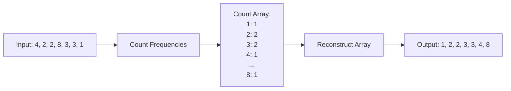
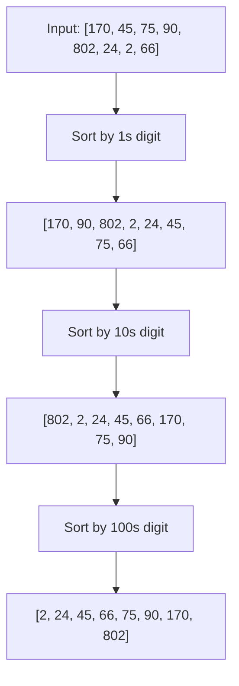

# 📊 Sorting — Complete Learning Guide

## 1. Bubble Sort


**Example (Dry Run):** `[5, 3, 8, 4, 2]`
- Pass 1: `[3, 5, 8, 4, 2]` ➔ `[3, 5, 4, 8, 2]` ➔ `[3, 5, 4, 2, 8]` (8 is fixed)
- Pass 2: `[3, 4, 5, 2, 8]` ➔ `[3, 4, 2, 5, 8]` (5 is fixed)
- Pass 3: `[3, 2, 4, 5, 8]` (4 is fixed)
- Pass 4: `[2, 3, 4, 5, 8]` (Sorted!)

```java
// Sabse simple — adjacent elements swap karo agar wrong order mein hain
// Time: O(n²), Space: O(1), Stable: Yes

public static void bubbleSort(int[] arr) {
    int n = arr.length;
    for (int i = 0; i < n - 1; i++) {         // n-1 passes
        boolean swapped = false;
        for (int j = 0; j < n - 1 - i; j++) { // har pass mein last element fix
            if (arr[j] > arr[j + 1]) {
                int temp = arr[j]; arr[j] = arr[j + 1]; arr[j + 1] = temp;
                swapped = true;
            }
        }
        if (!swapped) break;                   // already sorted
    }
}
```

## 2. Selection Sort


**Example (Dry Run):** `[29, 10, 14, 37, 13]`
- Pass 1: Find min `10`, swap with `29` ➔ `[10, 29, 14, 37, 13]`
- Pass 2: Find min `13`, swap with `29` ➔ `[10, 13, 14, 37, 29]`
- Pass 3: Find min `14`, swap with `14` ➔ `[10, 13, 14, 37, 29]`
- Pass 4: Find min `29`, swap with `37` ➔ `[10, 13, 14, 29, 37]` (Sorted!)

```java
// Minimum dhundho, front mein daalo
// Time: O(n²), Space: O(1), Stable: No

public static void selectionSort(int[] arr) {
    int n = arr.length;
    for (int i = 0; i < n - 1; i++) {
        int minIdx = i;
        for (int j = i + 1; j < n; j++) {
            if (arr[j] < arr[minIdx]) minIdx = j; // minimum dhundho
        }
        int temp = arr[i]; arr[i] = arr[minIdx]; arr[minIdx] = temp; // swap
    }
}
```

## 3. Insertion Sort


**Example (Dry Run):** `[4, 3, 2, 10]`
- `i=1` (key=3): Shift 4 right, insert 3 ➔ `[3, 4, 2, 10]`
- `i=2` (key=2): Shift 4, 3 right, insert 2 ➔ `[2, 3, 4, 10]`
- `i=3` (key=10): 10 is > 4, no shift ➔ `[2, 3, 4, 10]` (Sorted!)

```java
// Card sorting jaisa — sahi jagah insert karo
// Time: O(n²), Space: O(1), Stable: Yes, Best for small/nearly sorted

public static void insertionSort(int[] arr) {
    for (int i = 1; i < arr.length; i++) {
        int key = arr[i];                      // current element
        int j = i - 1;
        while (j >= 0 && arr[j] > key) {       // shift karo right
            arr[j + 1] = arr[j];
            j--;
        }
        arr[j + 1] = key;                     // sahi jagah insert karo
    }
}
```

## 4. Merge Sort ⭐ (MUST KNOW!)


**Example (Dry Run):** `[38, 27, 43, 3, 9, 82, 10]`
- **Divide:** Break into smaller arrays. `[38]`, `[27]`, `[43]`, `[3]`, `[9]`, `[82]`, `[10]`.
- **Merge:** Combine sorted arrays.
  - `[27, 38]` and `[43]` ➔ `[27, 38, 43]`
  - `[3, 9]` and `[10, 82]` ➔ `[3, 9, 10, 82]`
  - Finally merge both ➔ `[3, 9, 10, 27, 38, 43, 82]`

```java
// Divide and Conquer — split karo, sort karo, merge karo
// Time: O(n log n), Space: O(n), Stable: Yes

public static void mergeSort(int[] arr, int left, int right) {
    if (left >= right) return;                 // base case

    int mid = left + (right - left) / 2;
    mergeSort(arr, left, mid);                 // left half sort
    mergeSort(arr, mid + 1, right);            // right half sort
    merge(arr, left, mid, right);              // merge karo
}

private static void merge(int[] arr, int left, int mid, int right) {
    int[] temp = new int[right - left + 1];
    int i = left, j = mid + 1, k = 0;

    while (i <= mid && j <= right) {           // dono halves compare karo
        if (arr[i] <= arr[j]) temp[k++] = arr[i++];
        else temp[k++] = arr[j++];
    }
    while (i <= mid) temp[k++] = arr[i++];     // left remaining
    while (j <= right) temp[k++] = arr[j++];   // right remaining

    System.arraycopy(temp, 0, arr, left, temp.length); // copy back
}
```

## 5. Quick Sort ⭐ (MUST KNOW!)


**Example (Dry Run):** `[10, 80, 30, 90, 40, 50, 70]`
- **Pivot:** `70`. Compare elements with `70` and move smaller to the left.
- **Partition:** `[10, 30, 40, 50, 70, 90, 80]` (Pivot `70` is now at its correct sorted position).
- Recursively apply Quick Sort on left `[10, 30, 40, 50]` and right `[90, 80]`.

```java
// Partition based — pivot choose karo, chhote left, bade right
// Time: O(n log n) avg, O(n²) worst, Space: O(log n), Stable: No

public static void quickSort(int[] arr, int low, int high) {
    if (low >= high) return;

    int pivotIdx = partition(arr, low, high);
    quickSort(arr, low, pivotIdx - 1);         // left side sort
    quickSort(arr, pivotIdx + 1, high);        // right side sort
}

private static int partition(int[] arr, int low, int high) {
    int pivot = arr[high];                     // last element = pivot
    int i = low - 1;                           // chhote elements ka boundary

    for (int j = low; j < high; j++) {
        if (arr[j] < pivot) {
            i++;
            int temp = arr[i]; arr[i] = arr[j]; arr[j] = temp; // swap
        }
    }

    int temp = arr[i + 1]; arr[i + 1] = arr[high]; arr[high] = temp; // pivot sahi jagah
    return i + 1;                              // pivot ka final index
}
```

## 6. Counting Sort



**Example (Dry Run):** `[4, 2, 2, 8, 3, 3, 1]` (max = 8)
- **Count Array:** Create array of size 9 (0 to 8). Count frequencies:
  `count[1]=1, count[2]=2, count[3]=2, count[4]=1, count[8]=1`
- **Reconstruct:** Iterate over count array and overwrite original array:
  Output: `[1, 2, 2, 3, 3, 4, 8]`

```java
// Range known ho toh O(n + k) mein sort
// Time: O(n + k), Space: O(k), Stable: Yes

public static void countingSort(int[] arr, int maxVal) {
    int[] count = new int[maxVal + 1];
    for (int num : arr) count[num]++;          // count karo

    int idx = 0;
    for (int i = 0; i <= maxVal; i++) {
        while (count[i] > 0) {
            arr[idx++] = i;                    // count ke hisaab se fill karo
            count[i]--;
        }
    }
}
```

## 7. Radix Sort



**Example (Dry Run):** `[170, 45, 75, 90, 802, 24, 2, 66]`
- **1s Place (Units):** `170, 90, 802, 2, 24, 45, 75, 66` (Sorted by last digit)
- **10s Place (Tens):** `802, 2, 24, 45, 66, 170, 75, 90` (Sorted by tens digit)
- **100s Place (Hundreds):** `2, 24, 45, 66, 75, 90, 170, 802` (Sorted by hundreds)
- Result is fully sorted!

```java
// Digit by digit sort karta hai (using stable sort like Counting Sort)
// Time: O(d * (n + k)), Space: O(n + k), Stable: Yes (d = max digits)

public static void radixSort(int[] arr) {
    if (arr.length == 0) return;
    int max = arr[0];
    for (int num : arr) {
        if (num > max) max = num;              // max number dhundho
    }
    
    // Har digit ke liye counting sort (exp = 1, 10, 100...)
    for (int exp = 1; max / exp > 0; exp *= 10) {
        countSortForRadix(arr, exp);
    }
}

private static void countSortForRadix(int[] arr, int exp) {
    int n = arr.length;
    int[] output = new int[n];
    int[] count = new int[10];                 // base 10 (0-9 digits)
    
    // Frequencies of current digit
    for (int i = 0; i < n; i++) {
        count[(arr[i] / exp) % 10]++;
    }
    
    // Prefix sum for positions
    for (int i = 1; i < 10; i++) {
        count[i] += count[i - 1];
    }
    
    // Build output array (Right to Left loop so it remains STABLE)
    for (int i = n - 1; i >= 0; i--) {
        int digit = (arr[i] / exp) % 10;
        output[count[digit] - 1] = arr[i];
        count[digit]--;
    }
    
    // Copy back to original array
    System.arraycopy(output, 0, arr, 0, n);
}
```

## 📊 Comparison Table

| Algorithm | Best     | Average  | Worst    | Space   | Stable |
| --------- | -------- | -------- | -------- | ------- | ------ |
| Bubble    | O(n)     | O(n²)    | O(n²)    | O(1)    | ✅     |
| Selection | O(n²)    | O(n²)    | O(n²)    | O(1)    | ❌     |
| Insertion | O(n)     | O(n²)    | O(n²)    | O(1)    | ✅     |
| **Merge** | O(nlogn) | O(nlogn) | O(nlogn) | O(n)    | ✅     |
| **Quick** | O(nlogn) | O(nlogn) | O(n²)    | O(logn) | ❌     |
| Counting  | O(n+k)   | O(n+k)   | O(n+k)   | O(k)    | ✅     |
| Radix     | O(d*(n+k))| O(d*(n+k))| O(d*(n+k))| O(n+k)  | ✅     |

## Java Built-in Sort

```java
Arrays.sort(arr);                              // primitive: Dual-Pivot QuickSort
Arrays.sort(arr, (a, b) -> a - b);             // objects: TimSort (stable)
Collections.sort(list);                        // List sort: TimSort
```

---

> **Next:** [PROBLEMS.md](PROBLEMS.md) 💪
